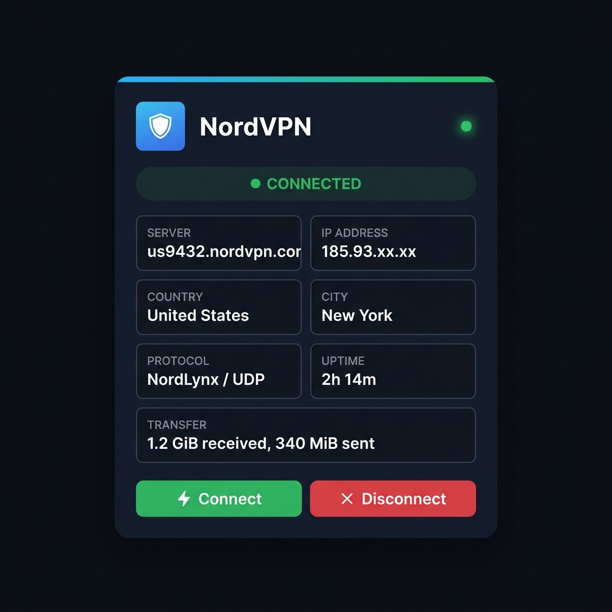

# NordVPN Dashboard

A lightweight, self-hosted web dashboard for monitoring and controlling [NordVPN](https://nordvpn.com/) via its CLI. Built with Python/Flask — single file, zero frontend dependencies, zero databases.



## Features

- **Live status** — auto-polls every 8 s, no page flicker
- **One-click controls** — connect & disconnect
- **Connection details** — server, IP, country, city, protocol, uptime, transfer
- **Visual feedback** — pulsing beacon, animated gradient bar, skeleton loaders
- **iFrame-ready** — designed for [Homarr](https://homarr.dev/), Homer, Dashy, or any dashboard
- **JSON API** — `/api/status`, `/api/connect`, `/api/disconnect`
- **Dark theme** — blends into any dark dashboard
- **Configurable** — port, poll interval, and bind address via environment variables

## Requirements

- Debian/Ubuntu machine or LXC container
- [NordVPN CLI](https://nordvpn.com/download/linux/) installed and logged in
- Python 3.8+
- Root access

---

## Installation

### 1. Install Python

```bash
apt-get update && apt-get install -y python3 python3-pip python3-venv
```

### 2. Create a virtual environment

```bash
python3 -m venv /opt/vpn-dashboard-venv
/opt/vpn-dashboard-venv/bin/pip install flask
```

### 3. Copy the app

```bash
mkdir -p /opt/vpn-dashboard
```

Copy [`app.py`](app.py) to `/opt/vpn-dashboard/app.py` on your server.

**Alternatively**, if you're in a headless console, you can paste the entire file directly:


```bash
cat << 'EOF' > /opt/vpn-dashboard/app.py
<paste app.py here>
EOF
```


### 4. Install the systemd service

Copy [`vpn-dashboard.service`](vpn-dashboard.service) to `/etc/systemd/system/`:

```bash
cp vpn-dashboard.service /etc/systemd/system/
systemctl daemon-reload
systemctl enable --now vpn-dashboard.service
```

**Alternatively**, paste it directly via console:

```bash
cat << 'EOF' > /etc/systemd/system/vpn-dashboard.service
[Unit]
Description=NordVPN Dashboard (Flask)
After=network.target nordvpnd.service
Wants=nordvpnd.service

[Service]
Type=simple
User=root
Environment=HOME=/root
Environment=VPN_DASH_PORT=8080
ExecStart=/opt/vpn-dashboard-venv/bin/python3 /opt/vpn-dashboard/app.py
WorkingDirectory=/opt/vpn-dashboard
Restart=always
RestartSec=5
StandardOutput=journal
StandardError=journal

[Install]
WantedBy=multi-user.target
EOF

systemctl daemon-reload
systemctl enable --now vpn-dashboard.service
```

### 5. Verify

```bash
systemctl status vpn-dashboard
curl http://localhost:8080/api/status
```

Open `http://<your-server-ip>:8080` in a browser.

---

## Configuration

Override defaults via environment variables in the service file:

| Variable | Default | Description |
|---|---|---|
| `VPN_DASH_HOST` | `0.0.0.0` | Bind address |
| `VPN_DASH_PORT` | `8080` | Listen port |
| `VPN_DASH_POLL_MS` | `8000` | Frontend polling interval (ms) |

Edit `/etc/systemd/system/vpn-dashboard.service`, then:

```bash
systemctl daemon-reload && systemctl restart vpn-dashboard
```

---

## Embedding in Homarr

1. Open your Homarr dashboard → **Edit Mode**
2. Add an **iFrame Widget**
3. Set the URL to `http://<your-server-ip>:8080`
4. Resize to roughly 2×3 tiles
5. Save

> The buttons use plain `<a>` links instead of JavaScript `onclick`, so they work even behind Homarr's iframe overlay.

---

## Surviving Reboots

The systemd service auto-starts on boot. For full resilience, also enable NordVPN auto-connect:

```bash
nordvpn set autoconnect on
```

If you're using this machine as a VPN gateway with NAT, persist your iptables rules:

```bash
apt-get install -y iptables-persistent
```

---

## API

| Endpoint | Method | Description |
|---|---|---|
| `/api/status` | `GET` | Current NordVPN status as JSON |
| `/api/connect` | `POST` | Connect (optional `{"country": "US"}` body) |
| `/api/disconnect` | `POST` | Disconnect |
| `/?action=connect` | `GET` | Connect and redirect (iframe workaround) |
| `/?action=disconnect` | `GET` | Disconnect and redirect (iframe workaround) |

Example:

```bash
curl -X POST http://localhost:8080/api/connect \
  -H 'Content-Type: application/json' \
  -d '{"country": "Germany"}'
```

---

## Troubleshooting

| Problem | Solution |
|---|---|
| Service won't start | `journalctl -u vpn-dashboard -f` |
| `$HOME is not defined` | Ensure the service has `Environment=HOME=/root` |
| `nordvpn: command not found` | Install NordVPN CLI first |
| Port conflict | Set `VPN_DASH_PORT=9090` in the service file |

---

## Project Structure

```
nordvpn-dashboard/
├── app.py                    # Flask application (single file)
├── vpn-dashboard.service     # systemd unit file
├── screenshot.png
├── LICENSE
├── .gitignore
└── README.md
```

## License

[MIT](LICENSE)
